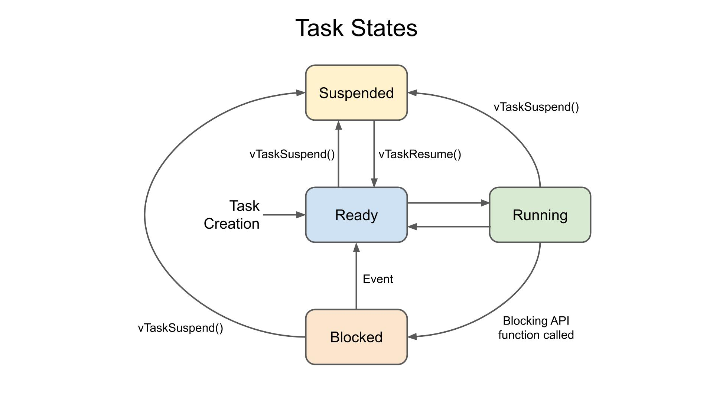

###########################
Real-Time Operating Systems
###########################

Real-time operating systems (RTOS) are designed to process data as it comes in, typically without buffering delays. They are used in embedded systems where timing is critical, such as in medical devices, automotive systems, and industrial control systems. RTOS are characterized by their ability to manage hardware resources efficiently and provide predictable response times.

Operating Systems
=================

    Operating System State Machine

    Superloop Operations

.. figure:: assets/rtos.jpg
    :alt: RTOS
    :align: center

    RTOS Operations

    Superloop vs RTOS