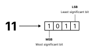
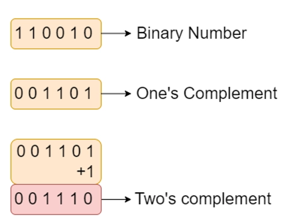
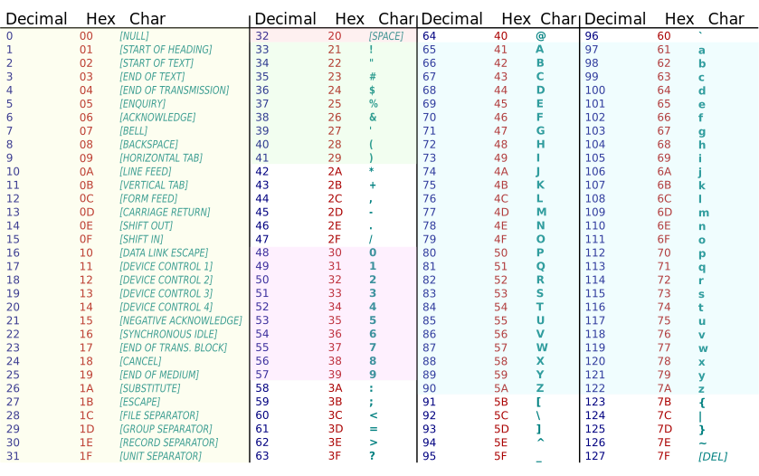
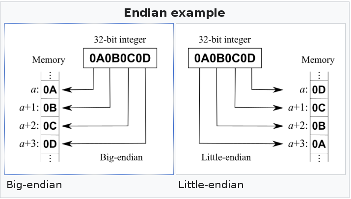
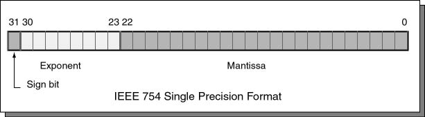
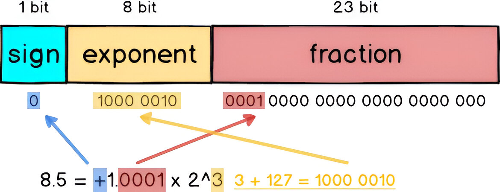

##############
Digital Design
##############

Binary Representation
=====================

Binary representation is a numerical system with a base-2 system of either a zero or one. Binary numbers have a dynamic range that go between 0 and 1 for a single digit where as the common base-10 numerical system have a dynamic range between 0 and 9. Appending more digits to the binary value extends the dynamic range of the number which has an equivalent mapping to the base-10 system. Additionally, binary values are typically grouped into 4 bits called a nibble and 8 bits called a byte. The hexadecimal system is commonly used for representing binary values in a more compact form where each hexadecimal digit represents 4 bits in binary.

Signed representation of binary numbers are typically represented using the two's complement where the most significant bit (MSB) is used to represent the sign of the number.

    Binary Representation

The two's complement uses the most significant bit (MSB) to represent the sign. The remaining bits are used to represent the magnitude of the number. To convert a binary number to its two's complement representation, you can invert all the bits and add 1 to the result. Additionally, the use of a sign bit divides the dynamic range of the number in half where the positive numbers have a dynamic range between 0 and 2\ :sup:`n-1` - 1 and the negative numbers have a dynamic range between -1 and -2\ :sup:`n-1` where n is the number of bits used to represent the number.

    Two's Compliment

A byte is typically the smallest addressable unit of memory in most computer architectures which can represent 256 different values. The ASCII encoding is a common character encoding standard to represent alphanumeric characters.

    Decimal/Hex/ASCII Table

    Endianness

In the memory organization of a computer, the endianness refers to the order in which bytes are stored in memory. In a little-endian system, the least significant byte is stored at the lowest memory address and the most significant byte is stored at the highest memory address. In a big-endian system, the MSB is stored at the lowest memory address and the LSB is stored at the highest memory address. Endianness can affect how data is interpreted when it is read from memory and can lead to issues when transferring data between systems with different endianness. When transmitting bytes over a network, it is important to validate the endianness of the data to ensure it is properly encoded and decoded properly.

Floating Point Representation
-----------------------------

Aside from descrete values, a standard is defined for representing real numbers in binary which is called the IEEE 754 standard. The standard defines a signed bit, an exponent, and a significand (also called the mantissa) to represent real numbers in binary. The standard defines several formats for representing real numbers including single precision (32 bits) and double precision (64 bits). The standard also defines special values for representing infinity and NaN (not a number).

Non-standard representations also exist to accomodate specific use cases and applications (such as limited hardware capabilities) stored in a fixed-point representation.

    Single Precision Floating Point

    Single Precision Floating Point Example

Floating point calculations are implemented specifically by the hardware vendor which makes comparisons between different hardware non-precise. Additionally, the precision of floating point numbers are limited by the number of bits allocated for the significand and exponent which can lead to precision issues when performing calculations with floating point numbers. With single precision, one can typically expect around 7 decimal digits of precision and with double precision, one can typically expect around 15 decimal digits of precision. These precision issues are important to consider when working with high-precision calculations such as in scientific computing, machine learning, and graphics rendering. (In latitude and longitude coordinates, precision issues can arise when working with very small differences in coordinates which can lead to significant errors in distance calculations.)

.. warning::
    Comparing two floating point numbers for equality is not recommended due to the precision issues that can arise from the representation and calculations of floating point numbers. Instead, it is recommended to compare the absolute difference between two floating point numbers to a small threshold value (also called epsilon) to determine if they are approximately equal.

Binary Operators
----------------

- bitshifting
- xor
- or
- and

Bit Manipulation
----------------

A large variety of bit twiddling hacks exists and were commonly used in many arcade games to make efficient use of compute and memory. Several bit twiddling operations are documented `here <https://graphics.stanford.edu/~seander/bithacks.html>`_.