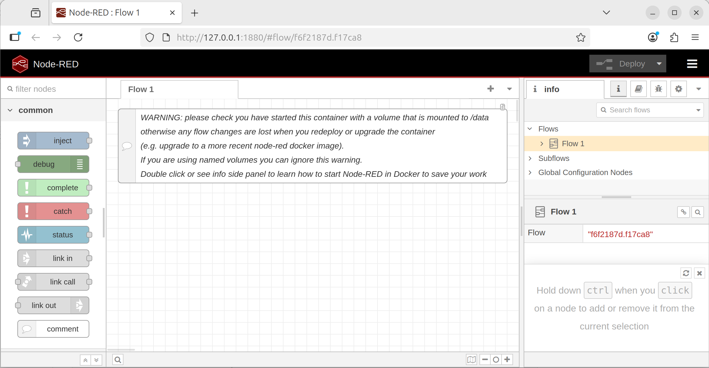

######################
Practical Docker Guide
######################

The previous section covered basics into building and running containers using docker. Extending from the basics covered prior, practical usage of containers is discussed here. In particular the ``docker run`` command is used more extensively along with interactions with docker volumes and docker networks. The ``docker compose`` plugin is covered at the end to highlight a quicker and trackable container configuration.

============================
Node-Red Example Application
============================

The application to expand upon will be NodeRed. The latest as of writing is version 4.1. `NodeRed <https://nodered.org/>`_ is a visual programming tool for wiring hardware devices together. NodeRed provides a web user interface (UI) for interacting with the tool. First pull the image and run the instance. 

.. code-block:: bash
    :caption: Pull and run the NodeRed image

    # pull the docker image
    docker pull nodered/node-red:4.1-debian

Ports
=====

Since the container is, for the most part, isolated from the host, ports will need to be exposed from the container to the host so that the port can be accessed. To expose the port, the ``-p HOST_PORT:CONTAINER_PORT`` argument is provided to ``docker run`` which performs the port remapping.

From the documentation, Node-Red uses port 1880 to serve the web ui and thus the float ``-p 1880:1880`` is added to the ``docker run`` command to link the host's 1880 port to the container's 1880 port. Docker performs the port remapping in where an alternative port can be used instead of the required one for the container. For example to use port 1990 on the host, use ``-p 1990:1880``.

.. note::
    By default, if not specified, ports are assumed to be TCP ports. To remap a UDP port, append the string ``/udp`` to the port to be remapped.
    
    For example: ``-p 123:123/udp``

.. code-block:: bash
    :caption: Run the NodeRed image and expose port 1880

    # from the documentation for node-red, the web ui is exposed on port 1880
    # --rm to delete the container after closing
    # -p to map the host port 1880 to the container port 1880 (HOST_PORT:CONTAINER_PORT)
    docker run --rm -p 1880:1880 nodered/node-red:4.1-debian

Once the container is running, output is generated from the container with the port 1880 exposed. Visit the host address and port 1880: http://localhost:1880 to bring up the Node-Red web UI.

.. code-block:: text
    :caption: ``docker run`` sample output

    11 Nov 21:11:54 - [info] 

    Welcome to Node-RED
    ===================

    11 Nov 21:11:54 - [info] Node-RED version: v4.1.1
    11 Nov 21:11:54 - [info] Node.js  version: v20.19.5
    11 Nov 21:11:54 - [info] Linux 6.14.0-35-generic x64 LE
    11 Nov 21:11:54 - [info] Loading palette nodes
    11 Nov 21:11:55 - [info] Settings file  : /data/settings.js
    11 Nov 21:11:55 - [info] Context store  : 'default' [module=memory]
    11 Nov 21:11:55 - [info] User directory : /data
    11 Nov 21:11:55 - [warn] Projects disabled : editorTheme.projects.enabled=false
    11 Nov 21:11:55 - [info] Flows file     : /data/flows.json
    11 Nov 21:11:55 - [warn] 

    ---------------------------------------------------------------------
    Your flow credentials file is encrypted using a system-generated key.

    If the system-generated key is lost for any reason, your credentials
    file will not be recoverable, you will have to delete it and re-enter
    your credentials.

    You should set your own key using the 'credentialSecret' option in
    your settings file. Node-RED will then re-encrypt your credentials
    file using your chosen key the next time you deploy a change.
    ---------------------------------------------------------------------

    11 Nov 21:11:55 - [info] Server now running at http://127.0.0.1:1880/
    11 Nov 21:11:55 - [warn] Encrypted credentials not found
    11 Nov 21:11:55 - [info] Starting flows
    11 Nov 21:11:55 - [info] Started flows

    Node-Red WebUI sample running from a container

Volumes
=======

Previously, notice that any "Flows" created do not exist when removing and starting back up the container. The docker container starts from the state of the image's snapshot and thus if the saved data (ie; Node-Red Flows) is not added during the build of the image, it will not exist when the container is ran from the image. Docker volumes enable data persistence after the container exists by housing a separate filesystem that is mounted into the container when it starts. The mount process is similar to mounting USB drives on linux systems where a designated directory will contain the data of the separate filesystem. Thus, a designated target directory within the container is needed for where data is to be persisted.

Docker volumes have different volume types which have their own preferred use-case. The most common are bind mounts, named/anonymous volumes, and tmpfs mounts. Attaching a volume is done by supplying the ``-v VOLUME:CONTAINER_PATH`` flag to the ``docker run`` command. ``VOLUME`` is a docker volume or bind mount and the ``CONTAINER_PATH`` is the path within the container for where the volume is mounted to. Volumes can be mounted to multiple containers at a time and provide a method for communicating between containers.

.. note::
    Volumes support a variety of other operations which are not all listed here. Refer to the volume reference page for more details for other options.

    - https://docs.docker.com/reference/cli/docker/volume/
    - https://docs.docker.com/reference/cli/docker/container/run/ 

Bind Mounts
-----------

Bind mounts are perhaps the simplest and most straightforward. In the case of bind mounts, ``VOLUME`` is a path on the host is directly mounted into the container. Depending on the containerization tools (docker/podman/kubernetes), the path on the host may be required to already exist before the container can start. Minor nuanced discrepancies may exist with host and container filesystem incompatibilities.

.. warning::
    Since the host directory is mounted as is, it inherits the permissions as well which may not align between the host and the container. The permission mismatch is the cause of many issues in regards to bind mounts. Ensure that the UID:GID of the container matches to have the proper read/write permissions to properly access the bind mount.

From the Node-Red documentation on the `DockerHub image page <https://hub.docker.com/r/nodered/node-red>`_, data is persisted to the ``/data`` directory within the image.

.. code-block:: bash
    :caption: Run the NodeRed with a bind mount

    # create data to bind mount into the container
    mkdir data

    # run the container and mount the data folder
    docker run --rm -p 1880:1880 -v ./data:/data nodered/node-red:4.1-debian

After creating some Node-Red flows in the web UI, restart the container and observe that the flows persist across container restarts. Additionally, inspect the newly created folder to see the data created by the container which also includes any created flows generated via the web UI.

Named/Anonymous Volumes
-----------------------

Volumes can be handled entirely by docker which are identified by the volume's name. The benefit of using named volume is that any permissions and creation of the filesystem itself are handled by docker. Named volumes are the preferred method because there are less possible issues that may arise due to host and container filesystem incompatibilities. Volumes can also be imported/exported across systems for portability.

.. code-block:: bash
    :caption: Create a Named/Anonymous Volumes

    # syntax for creating a named volume
    #  docker volume create [options] [NAME]

    # create a volume named "my-volume"
    docker volume create my-volume

    # create a volume with an randomly assigned name
    docker volume create

    # view volumes
    docker volume ls
    # DRIVER      VOLUME NAME
    # local       cdae1c7932a30af577d73ee325c6e56a940c792e52475e472b182c1d17d74655
    # local       my-volume

Using the named volume created, ``VOLUME`` is then specified using the named volume label (``VOLUME_NAME``) instead of a host path.

.. code-block:: bash
    :caption: Run the NodeRed with a named volume

    # run the container and mount the data folder
    docker run --rm -p 1880:1880 -v my-volume:/data nodered/node-red:4.1-debian

Making changes and restarting the container with the same volume mounts will then persist the information across container restarts.

``tmpfs`` Volumes
-----------------

``tmpfs`` is a temporary filesystem that persists on the host memory. When the container stops, the tmpfs mount is removed, and files written there won't be persisted. Host machines that have a designated tmpfs (`linux tmpfs <https://en.wikipedia.org/wiki/Tmpfs>`_) is utilized here which may offer performance optimizations or security benefits.

.. code-block:: bash
    :caption: Run the NodeRed with a tmpfs

    docker run --rm -p 1880:1880 --tmpfs /data nodered/node-red:4.1-debian

Networks
========

Networking easily grows in complexity so, to start, several types will be covered initially - host, bridge, none, overlay, and macvlan. Docker networks are implemented as different drivers. Networking enables containers to connect and communicate with other containers as well as other services on the network. Docker, by default creates a bridge network which is visible when running ``docker network ls``. Containers that aren't explicitly attached to a network are automatically connected to the default bridge network and can communicate with other containers on the same network. The default network additionally has access to the outside internet from the host using masquerading.

.. list-table:: Docker Network Drivers
   :header-rows: 1
   :widths: 25 75

   * - Driver
     - Description
   * - bridge
     - Default network driver for enabling containers on the same bridge to communicate together, blocking outside communication on the network
   * - host
     - Use the host network without isolation
   * - none
     - Use no networks, making the container isolated
   * - overlay
     - Specific network for docker swarm orchestration for communication across nodes
   * - ipvlan
     - Connect containers to external VLANs
   * - macvlan
     - Containers treated as separate devices on the network

``bridge`` Network Driver
-------------------------

The ``bridge`` network driver is the default network driver which defines a separate subnet for IPv4 and IPv6 access and attaches the container to the network with it's own IP address.

.. todo:: add sample outputs

.. code-block:: bash
    :caption: Create a network and connect a container to it

    # create a bridge network
    docker network create my-network

    # run a container attached to the created network with a name "container-1"
    docker run --rm -it --network my-network --name container-1 python:3.14.0-alpine sh
    
    # //// START CONTAINER COMMANDS
    # running in the container
    ip a
    # //// END CONTAINER COMMANDS

In a separate terminal, start another container.

.. code-block:: bash
    :caption: Create a second container and connect it to the existing network

    # run a container attached to the same network with a name "container-2"
    docker run --rm -it --network my-network --name container-2 python:3.14.0-alpine sh
    
    # //// START CONTAINER COMMANDS
    # running in the container
    ip a
    
    # ping the first container to verify a valid response connection
    ping container-1
    # //// END CONTAINER COMMANDS

Containers on the same network have unrestricted access to each other. Containers that are not on the same network won't be able to communicate with each other.

.. note::
    Containers on the bridge network have a modified DNS which can communicate with each other via the container's name or any hostname specified by ``--hostname``. The DNS on the docker network will resolve IPs for the hostname to the proper IP address.

.. note::
    Port mapping more specifically applies to bridge networks which creates explicit host/container communication. Port remapping is available regardless of the specific network the container is on.

``none`` Network Driver
-----------------------

The ``none`` network driver will make the network completely isolated. Running the following container and viewing the network interfaces will show none available.

.. code-block:: bash
    :caption: Viewing the ``none`` network driver will have no network interface

    # run a container without a network
    docker run --rm -it --network none ubuntu:22.04

    # //// START CONTAINER COMMANDS
    # running in the container
    ip a
    # //// END CONTAINER COMMANDS

``host`` Network Driver
-----------------------

The ``host`` network driver will make the container share the same network as the host machine.

.. code-block:: bash
    :caption: Viewing the ``host`` network driver will have the same network interface as the host machine

    # run a container without a network
    docker run --rm -it --network host ubuntu:22.04

    # //// START CONTAINER COMMANDS
    # running in the container
    ip a
    # //// END CONTAINER COMMANDS

.. warning::
    Containers that run services with port conflicts with the host will fail to run properly and exit.

.. note::
    Port remapping is not available on the host driver.

Secrets
=======

.. todo:: add secrets

##############
Docker Compose
##############