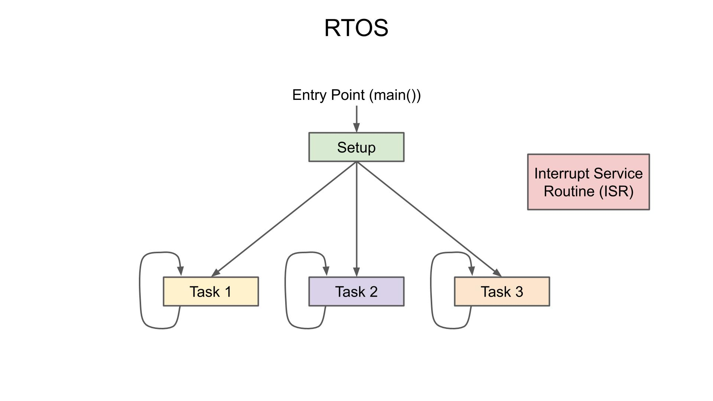

###########################
Real-Time Operating Systems
###########################

Real-time operating systems (RTOS) are designed to process data as it comes in, typically without buffering delays. They are used in embedded systems where timing is critical, such as in medical devices, automotive systems, and industrial control systems. RTOS are characterized by their ability to manage hardware resources efficiently and provide predictable response times.

Operating Systems
=================

Quick review on some operating system topics that are important to note when working with a RTOS. A microcontroller or microprocessor typically runs one or more cores that executes a set of instructions (machine code) to perform a task. The operating system manages the hardware and software resources of the system and is responsible for scheduling tasks and managing memory. Often times, many tasks need to be performed concurrently in which case, the operating system must interrupt and context switch between tasks to ensure that all tasks are completed in a timely manner.

.. figure:: assets/task-execution.gif
    :alt: Task Execution
    :align: center

    Task Execution

In multi-core systems such as a standard desktop or server, clock speeds are much faster (in the GHz range) and can handle many tasks concurrently. In contrast, microcontrollers typically operate at much lower clock speeds (in the MHz range) and have limited resources, making it more important and challenging to manage multiple tasks.

Operating System State Machine
------------------------------

A task's lifecyle is represented by a state machine where it transitions between a running, ready, blocked, and terminated state. The operating system also manages the memory allocation and deallocation as it context switches between tasks.

.. figure:: assets/os-state-machine.jpg
    :alt: Operating System State Machine
    :align: center

    Operating System State Machine

Now there are tradeoffs in managing multiple tasks and context switching across them. One of the more significant tradeoffs is the overhead introduced by context switching, making it less efficient as time is wasted transitioning between tasks. Running multiple tasks on a single-core is also useful in scenarios where tasks are I/O bound and spend a lot of time waiting for external events. A simple example being on downloading a file from the internet where the task is mostly waiting for the data to arrive. In this case, it makes sense to context switch to another task while waiting for the I/O bound task to complete.

Looking at more simpler microcontroller devices such as a common arduino ATMega. The footprint is much smaller and simpler and programming the device follows a more linear approach where a single task is executed in a loop. This is commonly referred to as a superloop architecture. In the superloop, an initial setup occurs and then tasks are executed and completed sequentially in aloop. The superloop is simple to implement and works well for simple applications with a highly efficient footprint.

.. figure:: assets/superloop.jpg
    :alt: Superloop
    :align: center

    Superloop Operations

In comparison, a RTOS allows for multiple tasks to be executed concurrently. The RTOS manages the priority, scheduling, and context switching between tasks such that tasks can be completed in a set timeframe. 

    RTOS Operations

.. figure:: assets/superloop-vs-rtos.jpg
    :alt: Superloop vs RTOS
    :align: center

    Superloop vs RTOS

Memory Management
=================

In developing software that completes a task, developers leverage the use of RAM for storing data structures in either the static, heap, or stack memory segments.

    RAM Static, Heap, Stack

On an RTOS system, each task is allocated its own stack memory segment in to store the task's data as it progresses throught the state machine. Since the memory footprint of a microcontroller is limitmed, it is important to monitor the RAM usage of the system to ensure that there is enough memory available for all tasks to run efficiently. Processing large data structures such as images or audio signals will need to be carefully managed to avoid segmentation faults or memory leaks.

.. figure:: assets/ram-free-rtos.jpg
    :alt: RTOS RAM
    :align: center

    RTOS RAM

Multi-Processing Cores
======================

Symmetrical Multi-Processing (SMP) is a method of using multiple processors or cores to execute tasks concurrently. In an SMP system, each core has access to the same memory space and can communicate with each other through shared memory. This allows for more efficient use of resources and can improve performance for tasks that can be parallelized. Asynchronous Multi-Processing (AMP) is another method of using multiple processors or cores where each core has its own memory space and operates independently. This can be useful for tasks that require a high degree of isolation or for systems that need to run different operating systems on each core. There are advantages on assigning specific tasks to designated cores that are specialized in a particular function such as DSP cores, AI cores, codec cores, etc.

The ESP32 has two identical cores for tasks to be assigned on and follow the SMP archtictecture.

.. figure:: assets/esp32-smp.jpg
    :alt: ESP32 SMP
    :align: center

    ESP32 SMP

- https://docs.espressif.com/projects/esp-idf/en/latest/esp32/api-reference/system/freertos_idf.html
- https://www.digikey.com/en/maker/projects/what-is-a-realtime-operating-system-rtos/28d8087f53844decafa5000d89608016