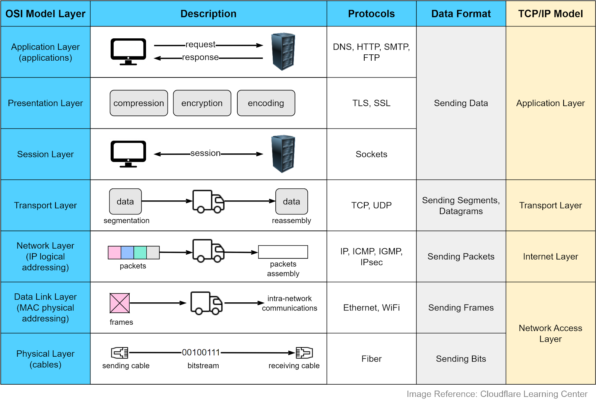
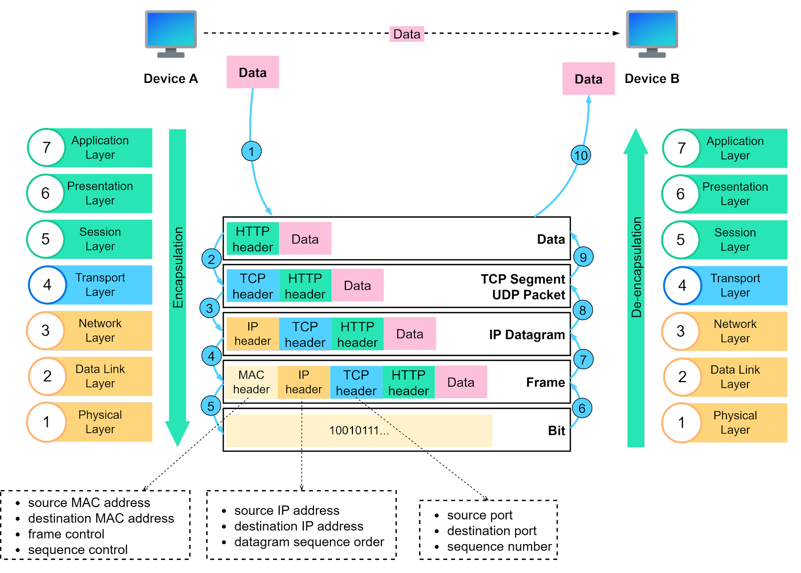
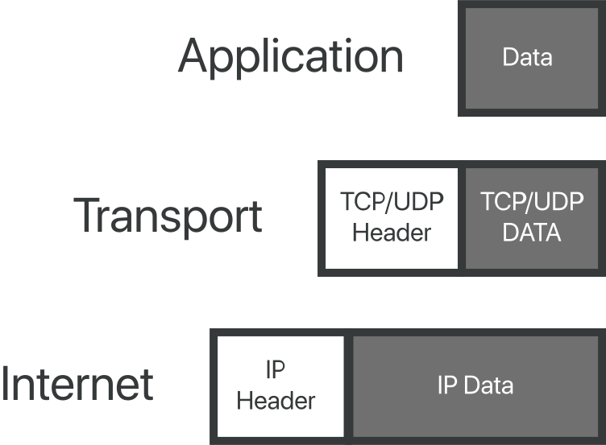
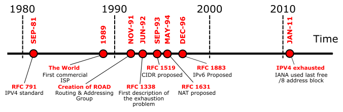

##########
Networking
##########

.. toctree::
   :maxdepth: 2
   :caption: Contents:

   communication-patterns

Networking allows for communication from one application to another which may exist on different machines. The Open Systems Interconnection (OSI) Model is commonly used to describe networking communication between applications. As data is transmitted through the layers of the OSI model, metadata is added to aid in the segmentation, transmission, and reconstruction of the data packets. In networking, a process accesses a the network with a combination of a network IP adderss, a transport protocol, and a port number using a socket. The IP address identifies the machine and typically uses TCP or UDP as transport protocols to connect to a given file descriptor identified as a port number.

----------------------------------------
Open Systems Interconnection (OSI) Model 
----------------------------------------

    The 7 OSI model layers [`Source <https://www.cloudflare.com/learning/ddos/glossary/open-systems-interconnection-model-osi/>`__]

    Network communication in the OSI model [`Source <https://bytebytego.com>`__]

----------------------
Internet Protocol (IP) 
----------------------

The Internet Protocol (IP) is most commonly used to transmit data over the internet. In particular, it defines the address to a recipient much like a piece of mail. Version 4 (IPv4) and Version 6 (IPv6) are the most commonly used addresses which are outlined in the RFC 791 and RFC 2460 specifications.

    
    IP Routing [`Source <https://www.cloudflare.com/learning/network-layer/internet-protocol/>`__]

IPv4 Addressing
---------------

IPv4 addresses are 32-bit addresses (2\ :sup:`32`; ie :math:`[0 - 4,294,967,296]` available addresses) divided across 4 octets (2\ :sup:`8`; ie :math:`[0 - 255]`) seperated by a period (``.``).

    IPv4 Addressing

For a local area network, the number of addresses typically suffices but globally, the IPv4 address space has been exhausted and moved towards the adoption of Version 6.

    IPv4 Address Exhaustion Timeline

IPv6 Addressing
---------------

IPv6 addresses are 128-bit addresses (2\ :sup:`128`, ie :math:`[0 - 340,282,366,920,938,463,463,374,607,431,768,211,456]` available addresses) divided across 8 quartets, where a quartet holds 4 hexadecimals (2\ :sup:`16`; ie :math:`[0-65535]` typically denoted as :math:`[0-9A-F]`),

    IPv6 Addressing

.. note::
    IPv6 leading zeros are commonly shorthanded to provide a shortened address for easier reading.
    
    | **Omitting Zero Quartets**
    | Original: ``2001:0DB8:0000:0000:0000:FF00:0042:8329``
    | Short: ``2001:DB8::FF00:42:8329``

    | **Omitting Leading Zeros**
    | Original: ``2001:0001:0002:0003:0004:0005:0006:0007``
    | Short: ``2001:1:2:3:4:5:6:7``

-------------------
Ports and Firewalls
-------------------

Ports are 16-bit unsigned integer values which ranges from 0-65535. Network critical port numbers less than 1024 are reserved and defined by the Internet Assigned Numbers Authority (IANA). Communication between processess poses security risks as machines are communicating between each other. The main mechanism on linux systems is through the use of a framework within the linux kernel, ``netfliter``, which allows for packet filtering, network address translation (NAT), and packet mangling.

.. figure:: assets/fw-netfilter.svg
    :alt: Netfiltering

    Packet flow in Netfilter and General Networking

Referneces
^^^^^^^^^^

.. - M5Stack Documentation https://docs.m5stack.com/ 
.. - ESP-IDF ESP32 Documentation https://docs.espressif.com/projects/esp-idf/en/stable/esp32/index.html
.. - ESP-IDF M5Stack Core 2 Component https://components.espressif.com/components/espressif/m5stack_core_2/versions/2.0.0
.. - ESP-IDF M5Stack BSP https://docs.m5stack.com/en/esp_idf/m5core2/bsp
.. - ESP-IDF Docker Documentation https://docs.espressif.com/projects/esp-idf/en/latest/esp32/api-guides/tools/idf-docker-image.html